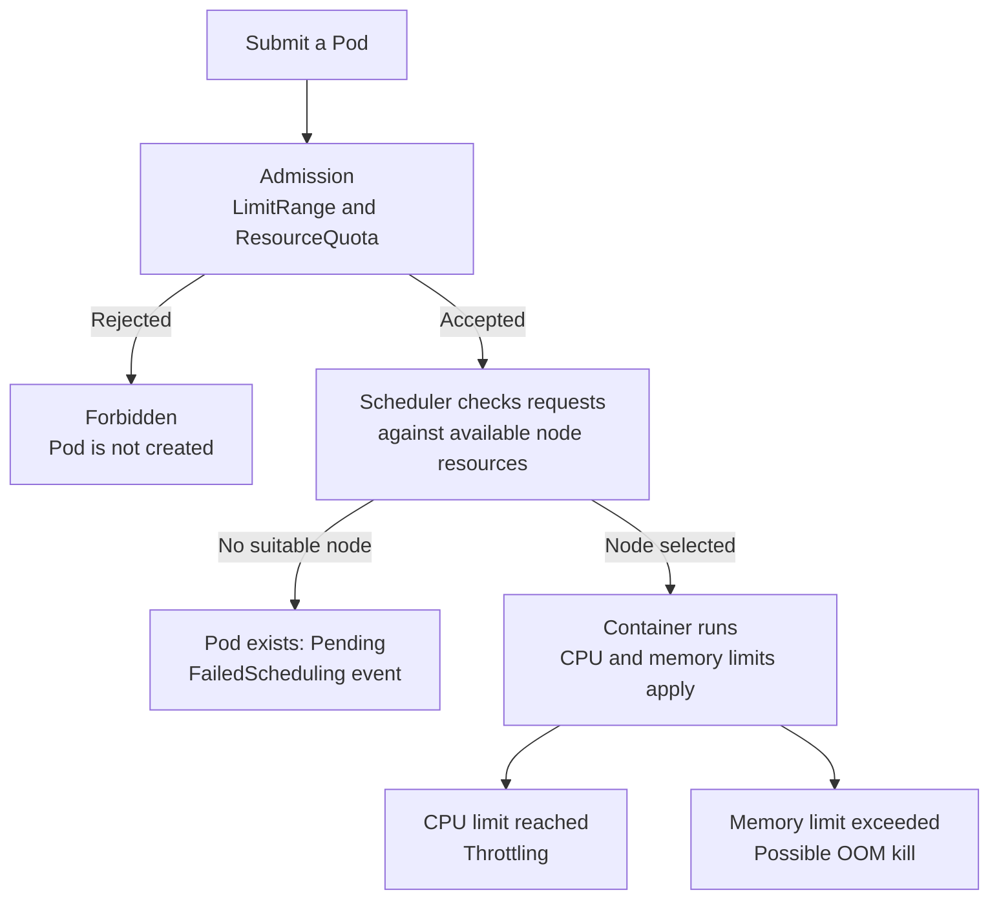

## Introduction

This article continues our [*CKAD preparation series*](https://supaahiro.github.io/schwifty-lab/blog-posts/20251019-ckad/article_EN.html), in the **Application Environment, Configuration and Security** domain:

> Understand requests, limits, quotas

In the [previous chapter](https://supaahiro.github.io/schwifty-lab/blog-posts/20261008-ckad/article_EN.html), we saw that authorization to create a Pod does not guarantee admission. Resource policies give us another practical example: a caller may have the right RBAC permissions, yet the namespace has no CPU budget left for another Pod.

There are also failures after admission. A Pod can exist but remain unscheduled, or run successfully until its container exhausts its memory limit. We will reproduce each situation and learn where to look for the explanation.

## Four Controls, Different Jobs

| Control | Where we declare it | What it does |
|---|---|---|
| Request | A container's `resources.requests` | Describes resources needed for scheduling; CPU requests also influence CPU sharing under contention |
| Limit | A container's `resources.limits` | Constrains resource consumption while the container runs |
| `LimitRange` | An object in a namespace | Supplies defaults and checks per-container or per-Pod bounds, depending on its type |
| `ResourceQuota` | An object in a namespace | Caps aggregate resource declarations and object counts |

The distinction matters when troubleshooting:



This diagram follows the resource checks only; authentication, authorization and other admission policies still apply.

### Reading resource quantities

`100m` CPU means one tenth of a CPU; `500m` equals `0.5`, and `"1"` means one CPU. It is an absolute quantity, not a percentage of the node. CPU requests cannot have precision finer than `1m`.

Memory is measured in bytes. `64Mi` is 64 × 1024 × 1024 bytes; `64M` is 64,000,000 bytes. Case matters: `64m` means 0.064 **bytes**, not 64 MiB.

A request is not a usage ceiling. A container can use more than its request when resources are available, subject to its limit. See [Resource Management for Pods and Containers](https://kubernetes.io/docs/concepts/configuration/manage-resources-containers/).

## Prerequisites and Resources

Use a disposable Kubernetes cluster with Linux nodes and the `LimitRanger` and `ResourceQuota` admission plugins enabled. You need `kubectl` and permission to create namespaces, Pods, Deployments, LimitRanges and ResourceQuotas. The lab namespaces `ckad-resources` and `ckad-resource-policy` must not already exist.

The examples were tested on **Kubernetes 1.35.1**, with cgroup v2. The CPU counter command below assumes cgroup v2; the other exercises do not. Metrics Server is optional. Extra admission policies or injected containers can change the results and quota arithmetic.

We use container-level resource declarations throughout. Kubernetes also supports Pod-level resource budgets on versions with `PodLevelResources` enabled; do not mix those into this lab's calculations.

```bash
git clone https://github.com/SupaaHiro/schwifty-lab.git
cd schwifty-lab/blog-posts/20261009-ckad
kubectl config current-context
kubectl apply -f manifests/01-namespaces.yaml
```

Check the context before creating anything. Run files in the sequence below: applying the whole directory at once would skip the before-and-after policy checks. Commands work in Bash or PowerShell unless a shell is named explicitly. No `k` alias is required.

## Step 1: Set Requests and Limits

Create our first Pod:

```bash
kubectl apply -f manifests/02-resources-pod.yaml
kubectl wait -n ckad-resources --for=condition=Ready pod/resources-demo --timeout=120s
kubectl describe pod resources-demo -n ckad-resources
```

The `app` container sleeps, with these declarations:

```yaml
resources:
  requests:
    cpu: 100m
    memory: 32Mi
  limits:
    cpu: 250m
    memory: 64Mi
```

It consumes little CPU, but its request still counts when the scheduler considers placing other Pods on its node. The scheduler uses requests and the node's allocatable resources, rather than a snapshot of idle CPU from `kubectl top`.

For a Pod containing only ordinary application containers, add their requests to calculate the Pod's request. Two containers requesting `100m` and `200m` need `300m` together. Init containers, restartable sidecars and Pod overhead have additional accounting rules; our single-container Pods avoid those complications. The [init container resource rules](https://kubernetes.io/docs/concepts/workloads/pods/init-containers/#resource-sharing-within-containers) explain the difference.

### What if only limits are set?

```bash
kubectl apply -f manifests/03-limits-only-pod.yaml
kubectl get pod limits-only -n ckad-resources -o yaml
```

The file specifies only a CPU limit of `100m` and a memory limit of `32Mi`. In this namespace, with no resource-defaulting policy, the admitted container has matching requests:

```yaml
resources:
  limits:
    cpu: 100m
    memory: 32Mi
  requests:
    cpu: 100m
    memory: 32Mi
```

Leaving requests out did not make this Pod free to schedule. Inspect the stored object rather than assuming the submitted YAML tells the whole story. The official [CPU defaulting walkthrough](https://kubernetes.io/docs/tasks/administer-cluster/manage-resources/cpu-default-namespace/) and [memory defaulting walkthrough](https://kubernetes.io/docs/tasks/administer-cluster/manage-resources/memory-default-namespace/) cover these cases.

### Check the QoS class

```bash
kubectl get pods -n ckad-resources -o custom-columns='NAME:.metadata.name,QOS:.status.qosClass'
```

For the container-level declarations used here:

| QoS class | CPU and memory declarations |
|---|---|
| `Guaranteed` | Every container has positive requests and limits for both resources, with each request equal to its corresponding limit |
| `Burstable` | At least one CPU or memory request or limit is set, but the Pod does not qualify as `Guaranteed` |
| `BestEffort` | No container has CPU or memory requests or limits |

`resources-demo` is `Burstable`; `limits-only` is `Guaranteed` after defaulting. QoS helps describe how Pods are handled under resource pressure; `Guaranteed` is not a promise that a container can never be killed. See [Pod Quality of Service Classes](https://kubernetes.io/docs/concepts/workloads/pods/pod-qos/).

## Step 2: Admit a Pod That Cannot Be Scheduled

`manifests/04-unschedulable-pod.yaml` requests **1000 CPUs**. On our small lab cluster, no node can satisfy that request:

```bash
kubectl apply -f manifests/04-unschedulable-pod.yaml
kubectl get pod too-large-to-schedule -n ckad-resources
kubectl describe pod too-large-to-schedule -n ckad-resources
```

Expect `Pending` and a `FailedScheduling` event containing `Insufficient cpu`. The API accepted the Pod; no container started. The value is deliberately excessive for the lab, not a suggested resource setting.

For a real workload, compare its requests with node allocatable resources and already allocated requests:

```bash
kubectl describe nodes
```

A quiet node can still have its schedulable capacity committed to other Pods. See [Assign CPU Resources to Containers and Pods](https://kubernetes.io/docs/tasks/configure-pod-container/assign-cpu-resource/) for the scheduling and CPU-limit exercises.

Remove this intentional failure before continuing:

```bash
kubectl delete pod too-large-to-schedule -n ckad-resources
```

## Step 3: Observe CPU Throttling and a Memory OOM Kill

CPU and memory limits have different runtime effects. CPU time can be delayed; memory allocations cannot be handled the same way.

### CPU: the container keeps running

Our `cpu-burn` container runs a busy loop with a `50m` CPU request and a `100m` CPU limit:

```bash
kubectl apply -f manifests/05-cpu-burn.yaml
kubectl wait -n ckad-resources --for=condition=Ready pod/cpu-burn --timeout=120s
kubectl exec -n ckad-resources cpu-burn -- cat /sys/fs/cgroup/cpu.stat
```

On cgroup v2, run the last command again after a few seconds. `nr_throttled` and `throttled_usec` should increase while the Pod stays `Running`. These are cumulative counters, so the exact numbers vary. They demonstrate that the container has demanded more CPU time than its limit permits.

If Metrics Server is installed, this is also useful:

```bash
kubectl top pod cpu-burn -n ckad-resources
```

Expect usage around the `100m` limit, with sampling variation. `kubectl top` reports measured usage, not declared requests, limits or quota consumption. The counter check works without Metrics Server. See the [cgroup v2 CPU interface](https://docs.kernel.org/admin-guide/cgroup-v2.html#cpu-interface-files) and the [kubectl top reference](https://kubernetes.io/docs/reference/kubectl/generated/kubectl_top/).

### Memory: the process is killed

Our Python container tries to allocate 256 MiB, while its memory limit is 32 MiB:

```bash
kubectl apply -f manifests/06-memory-burn.yaml
kubectl wait -n ckad-resources --for=jsonpath='{.status.phase}'=Failed pod/memory-burn --timeout=120s
kubectl describe pod memory-burn -n ckad-resources
```

Look under the container's terminated state for:

```text
Reason:       OOMKilled
Exit Code:    137
Restart Count: 0
```

Memory-limit enforcement is reactive: an allocation beyond the limit can trigger an OOM kill. We use `restartPolicy: Never` so the result remains easy to inspect. With `Always`, repeated failures can instead produce restarts and `CrashLoopBackOff`; inspect `Last State` and previous logs. Exit code 137 alone is not conclusive evidence of an OOM kill: check the termination reason. The official [memory resource exercise](https://kubernetes.io/docs/tasks/configure-pod-container/assign-memory-resource/) walks through this behavior.

Stop the busy loop and remove the failed Pod:

```bash
kubectl delete pod cpu-burn memory-burn -n ckad-resources
```

## Step 4: Put a Budget on a Namespace

We now move to `ckad-resource-policy`, keeping policy experiments separate from runtime failures.

Create `manifests/07-resource-quota.yaml`:

```yaml
apiVersion: v1
kind: ResourceQuota
metadata:
  name: team-budget
  namespace: ckad-resource-policy
spec:
  hard:
    requests.cpu: 500m
    requests.memory: 512Mi
    limits.cpu: "1"
    limits.memory: 1Gi
    pods: "4"
```

```bash
kubectl apply -f manifests/07-resource-quota.yaml
kubectl describe resourcequota team-budget -n ckad-resource-policy
```

These are separate budgets. `requests.cpu` sums declared CPU requests; `limits.cpu` sums CPU limits. Neither tracks current CPU usage. The `pods` quota counts non-terminal Pods, including unscheduled ones. Quotas limit what a namespace may claim; they do not reserve physical capacity on particular nodes. [Resource Quotas](https://kubernetes.io/docs/concepts/policy/resource-quotas/) documents the supported resources and scopes.

### A Pod without resource declarations

The next file intentionally omits `resources`. Try it without creating an object:

```bash
kubectl create --dry-run=server -f manifests/08-defaulted-pod.yaml
```

This command **must fail** at this stage. Expect `Forbidden`, `failed quota: team-budget` and missing fields such as `requests.cpu` and `limits.memory`. Our quota tracks all four CPU/memory fields, so admission needs values for all four.

`--dry-run=client` would not test that policy. Server-side dry-run goes through the API server's checks without persisting the Pod or reserving quota. It still needs the namespace and policies to exist. See [API dry-run](https://kubernetes.io/docs/reference/using-api/api-concepts/#dry-run).

## Step 5: Supply Defaults with LimitRange

Apply `manifests/09-limit-range.yaml`:

```yaml
apiVersion: v1
kind: LimitRange
metadata:
  name: container-bounds
  namespace: ckad-resource-policy
spec:
  limits:
    - type: Container
      min:
        cpu: 50m
        memory: 16Mi
      max:
        cpu: 500m
        memory: 256Mi
      defaultRequest:
        cpu: 100m
        memory: 64Mi
      default:
        cpu: 250m
        memory: 128Mi
```

```bash
kubectl apply -f manifests/09-limit-range.yaml
kubectl describe limitrange container-bounds -n ckad-resource-policy
kubectl create --dry-run=server -f manifests/08-defaulted-pod.yaml -o yaml
kubectl apply -f manifests/08-defaulted-pod.yaml
kubectl get pod defaulted -n ckad-resource-policy -o yaml
```

Now the same Pod is accepted. Inspect its container: requests are `100m` and `64Mi`; limits are `250m` and `128Mi`.

`defaultRequest` supplies requests; `default` supplies limits. This `Container` rule applies to each container, so adding a second container would consume another set of defaults. The `min` and `max` fields constrain declarations, not current usage. A LimitRange can also define a `maxLimitRequestRatio`, or use other types such as `Pod` and `PersistentVolumeClaim`.

New defaults do not rewrite existing Pods. Also check that defaults are compatible with explicitly supplied values: a default limit below an explicit request produces an invalid combination. See [Limit Ranges](https://kubernetes.io/docs/concepts/policy/limit-range/).

### Reject a container that exceeds the maximum

The next Pod explicitly asks for a `750m` CPU limit, exceeding the `500m` per-container maximum:

```bash
kubectl create --dry-run=server -f manifests/rejected/10-over-limit-range.yaml
```

Expect `Forbidden` and a message identifying the maximum CPU constraint. This is another **successful negative test**. There is no Pod to inspect afterward.

## Step 6: Find the Missing Deployment Replica

The `defaulted` Pod has already consumed `100m` of our `500m` CPU request budget. `manifests/11-quota-deployment.yaml` asks for three worker replicas. Each worker declares:

```yaml
resources:
  requests:
    cpu: 200m
    memory: 64Mi
  limits:
    cpu: 250m
    memory: 128Mi
```

```bash
kubectl apply -f manifests/11-quota-deployment.yaml
kubectl get deployment quota-workers -n ckad-resource-policy
kubectl get pods -n ckad-resource-policy
kubectl describe resourcequota team-budget -n ckad-resource-policy
kubectl describe replicaset -n ckad-resource-policy -l app=quota-workers
```

After the first two workers become ready, the Deployment remains at `2/3`. The arithmetic explains why:

| Stage | Total CPU requests | Quota |
|---|---:|---:|
| Existing `defaulted` Pod | `100m` | `500m` |
| Plus worker 1 | `300m` | `500m` |
| Plus worker 2 | `500m` | `500m` |
| Proposed worker 3 | `700m` | `500m` |

The ReplicaSet reports `FailedCreate` with `exceeded quota`, showing `requests.cpu=200m`, `used: requests.cpu=500m` and `limited: requests.cpu=500m`. The third Pod **does not exist**. It is not a `Pending` Pod.

Creating the Deployment succeeds because the controller creates its Pods separately. Even a successful server-side dry-run of a Deployment would not prove all of its replicas fit. The [CPU and memory quota walkthrough](https://kubernetes.io/docs/tasks/administer-cluster/manage-resources/quota-memory-cpu-namespace/) explains quota admission; controller-generated Pods must satisfy it too.

For this lab, make the desired replica count fit the existing budget:

```bash
kubectl scale deployment quota-workers -n ckad-resource-policy --replicas=2
kubectl rollout status deployment/quota-workers -n ckad-resource-policy --timeout=120s
```

In practice, the fix depends on the workload: adjust replica count, correct overstated requests, remove unused workloads, or arrange more namespace budget. Reducing a request changes scheduling and contention behavior, so it should reflect what the application needs.

Remember rolling updates too: `maxSurge` can temporarily require extra Pods and quota beyond the steady replica count. See [Deployments: rolling updates](https://kubernetes.io/docs/concepts/workloads/controllers/deployment/#rolling-update-deployment).

## Step 7: Hit the Pod Count Instead of the CPU Budget

First free one worker slot and wait until the Deployment has one replica:

```bash
kubectl scale deployment quota-workers -n ckad-resource-policy --replicas=1
kubectl rollout status deployment/quota-workers -n ckad-resource-policy --timeout=120s
kubectl get pods -n ckad-resource-policy
kubectl describe resourcequota team-budget -n ckad-resource-policy
```

Wait for quota usage to settle at **two Pods** and **`300m` CPU requests**: one defaulted Pod plus one worker. Quota accounting can take a moment to catch up after deletion.

Now create three smaller workers, each requesting and limiting `50m` CPU and `16Mi` memory:

```bash
kubectl apply -f manifests/12-pod-count-deployment.yaml
kubectl get deployment count-workers -n ckad-resource-policy
kubectl describe replicaset -n ckad-resource-policy -l app=count-workers
kubectl describe resourcequota team-budget -n ckad-resource-policy
```

Two new Pods fit, reaching four Pods and `400m` requested CPU. The third would take CPU requests to `450m`, still below `500m`, but would require a **fifth Pod**. Expect `2/3` replicas and a `FailedCreate` event mentioning `pods=1`, `used: pods=4`, `limited: pods=4`.

Every applicable quota constraint must pass. Spare CPU budget cannot compensate for an exhausted object-count budget.

## A Troubleshooting Checklist for the Exam

| Observation | Check | Likely explanation in this lab |
|---|---|---|
| Pod creation returns `Forbidden` | Read the API error; describe LimitRanges and ResourceQuotas | A declaration violates namespace policy |
| Pod exists but stays `Pending` | `kubectl describe pod` and node allocated requests | The scheduler cannot fit the request |
| Deployment exists but a replica has no Pod | Describe its ReplicaSet and quota | Pod creation was rejected |
| Container runs but CPU work is slow | CPU limit, throttling counters, optional metrics | CPU throttling |
| Container terminates with `OOMKilled` | Container state, memory limit and logs | Memory limit exceeded in this exercise |

Useful discovery commands when the exact fields escape you:

```bash
kubectl explain pod.spec.containers.resources
kubectl explain limitrange.spec.limits
kubectl explain resourcequota.spec.hard
kubectl get events -n ckad-resource-policy --sort-by=.metadata.creationTimestamp
```

## Cleanup

These namespaces were created exclusively for the lab. Delete them to remove the Pods, Deployments and policies, including both deliberately incomplete Deployments:

```bash
kubectl delete namespace ckad-resources ckad-resource-policy
```

We have now connected resource declarations to three observable outcomes: admission, scheduling and runtime behavior. Next in the series, we will use **ConfigMaps** to separate application configuration from container images.
